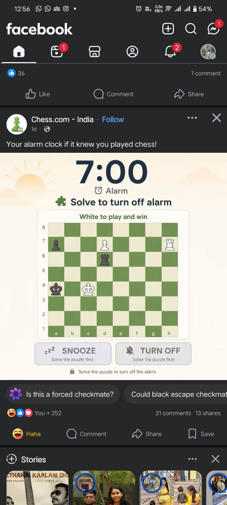

# Chess Alarm

Wake up by solving a chess puzzle.

One fine day I saw this post on Chess.com India's Facebook page:

> *"Your alarm clock if it knew you played chess!"*

<p align="center">
  
</p>

As a chess lover, that idea stuck. An alarm you can't dismiss with a sleepy swipe — you have to find the mate first. Chess Alarm is that joke turned into a real app.

## What it does

Chess Alarm is a local alarm clock for Android and iOS. When it rings, a mate-in-1 / mate-in-2 / mate-in-3 puzzle appears on a full chessboard. **Snooze** and **Turn Off** stay locked until you play the winning line. Wrong moves reveal progressive hints so you're never stuck forever — but you still have to think.

Puzzles come from the public [Lichess Puzzle API](https://lichess.org/api#tag/Puzzle). The app also ships with a bundled library so an alarm can always show a puzzle, even offline or when Lichess is rate-limiting downloads.


## How it works

### 1. Onboarding
First launch walks through the permissions an alarm actually needs: notifications, exact alarms, and (on Android) unrestricted battery so Doze doesn't silently kill your wake-up.

### 2. Home
Your alarm list. Add, edit, toggle on/off, and run a **Test alarm in 10 seconds** without waiting for morning. Each alarm can use a built-in sound, a system ringtone, or a custom file.

### 3. Ring (the whole point)
At the scheduled time the phone wakes, the alarm sound loops, and the ring screen opens over the lock screen when possible. You see:

- the current time
- a live chessboard with a mate puzzle matching your Settings
- **Snooze** and **Turn Off** — greyed out until the puzzle is solved

Play the solution moves on the board. After a wrong move, hints unlock in order: which piece to move → which square to land on → a short text tip. Solve it, and the buttons unlock so you can snooze or turn the alarm off.

### 4. Settings
Tune how hard you want mornings to be:

| Setting | Options |
|---------|---------|
| Difficulty | Easy / Medium / Hard |
| Mate in | 1 / 2 / 3 |
| Theme | Light / Dark / System |
| Alarm sound | Bundled tones, device ringtones, or custom |

You can also refresh the Lichess puzzle library from here. Downloads run in the background, merge into the local cache, and never wipe puzzles you already have.

### Puzzle library
- **Bundled seed pack** — 180 puzzles (20 per mate-in × difficulty) so ringing never depends on the network
- **Background sync** — fetches themed batches from Lichess, spaced to respect their rate limits, then caches them on device
- **Daily refresh** — stale packs can be refreshed; a manual Sync button re-runs batches without deleting existing puzzles

## Requirements

- Node.js ≥ 22
- Android Studio + SDK (device or emulator)
- Xcode (optional, for iOS)

## Setup

```bash
cd Chess-Alarm-Simple
npm install
npm run generate:alarm    # creates assets/alarm.wav if missing
npx react-native-asset    # links fonts from assets/fonts/
```

## Run

Start Metro:

```bash
npm start
```

In another terminal:

```bash
npm run android
# or
npm run ios
```

Release APK:

```bash
npm run build:android
```

## Android permissions

| Permission | Why |
|------------|-----|
| Notifications | Show the alarm notification / open the ring screen |
| Exact alarms (`USE_EXACT_ALARM`) | Fire at the set time, including under Doze |
| Battery unrestricted | Stop OEM battery savers from delaying alarms |
| Full-screen intent | Bring the puzzle screen up when the phone is locked |

Onboarding opens the relevant system screens when something still needs a manual grant.

## Project structure

```
src/
  screens/       Home, Ring, Onboarding, Settings, AlarmEdit
  services/      alarm scheduler (Notifee), ring audio, puzzle store/fetcher
  components/    board, alarm rows, sync progress, sound picker
  puzzles/       bundled seed pack + tiny offline fallback
  theme/         cream / orange design tokens
docs/
  inspiration-chesscom-india.jpg   # the Facebook post that started it
```

## Troubleshooting

- **No sound on Ring** — confirm `android/app/src/main/res/raw/alarm*.wav` exist; rebuild.
- **Alarm did not fire** — check notification + exact-alarm permissions; set battery to unrestricted.
- **Blank screen when ringing from lock screen** — grant full-screen notifications; reopen the app once so permissions sync.
- **Fonts look wrong** — run `npx react-native-asset` and rebuild.
- **Puzzle download stuck / 0 saved** — Lichess rate-limits by IP; the app pauses and retries automatically. Alarms still use the bundled pack in the meantime.

## License

MIT — see the repository [LICENSE](LICENSE).
